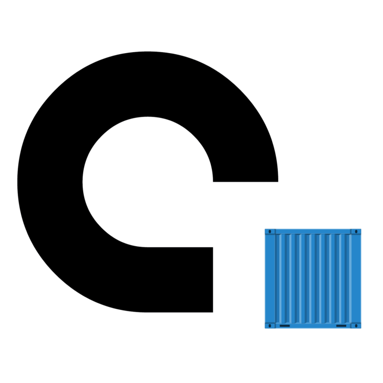

# 어디라카고 : 스마트 주차정보시스템 

 [2021년 스마트 해상물류 ICT멘토링 프로젝트](https://www.hanium.or.kr/upload/b0cf7e50-16a7-4b85-95e5-7dd475688de4.jpg) & [2021 스마트 해상물류 경진대회](https://www.hanium.or.kr/portal/subscription/info.do?trackSeq=10) 참가 작품 

---

## 서비스 구성도

---

업데이트 중!

